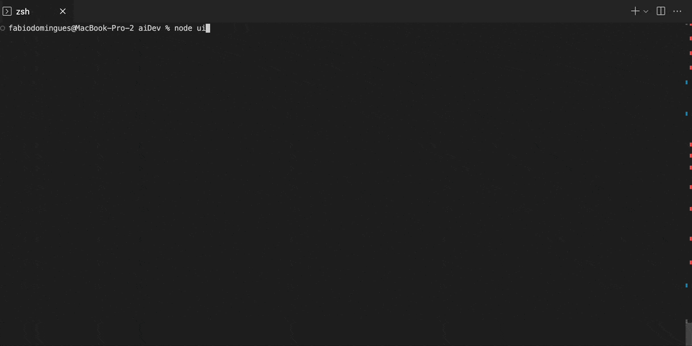

# Dev Autopilot - Using GPT to work on entire codebases

Dev Autopilot, a tool that uses GPT to read a codebase, create context and solve tasks.

What is does and how it works:

### CreateSummaries script:
- Read all relevant files in the project (first version uses .js files)
- Creates a summary (using GPT AI API) that represents a mental model for each file. This allow the app to work on bigger codebase that wouldn't fit GPT's context window.
- The app saves the summary next to each file with a .ai.txt extension for later.
- A watcher keeps updating files that are changed.
### UI script:
- The app takes into account the TASK and gets all the summary files (.ai.txt)
- Then uses GPT AI API to ask what files are relevant to the task, based on the summary of each
- Then using the previous reply, the app gets the source code of each relevant file and sends each to GPT to get the relevant context
- Then saves (temporarily) the output of each file
- Then sends the saved output to GPT and ask for the necessary changes to do the TASK
- Then creates a .md file with the suggestion to accomplish the TASK, along with source code that can be used.

## Installation

1. Clone the repository: `git clone https://github.com/user/repo.git`
2. Navigate to the project directory: `cd repo`
3. Install dependencies: `npm install`
4. Set up an OpenAI API key and update the `.env` file with the key: `OPENAI_API_KEY=<your-api-key>`

## Usage

To use the code summarization tool, follow these steps:

1. Navigate to the `ui.js` file and run it: `node ui.js`
2. Follow the prompts to provide the necessary input, including the task to complete and the relevant files.
3. The summarization tool will process the selected files and provide suggestions for the given task.
4. Suggestions will be saved in a `suggestions` folder inside the project directory.

## Components

- **createSummaryOfFiles.js**: Manages the code summarization process for JavaScript and TypeScript files.
- **gpt.js**: Implements the interaction with the OpenAI API to generate responses based on provided prompts.
- **ui.js**: Handles the user interface (UI) interaction and utilizes the GPT-based summaries to complete tasks.

## Contributing

We welcome contributions! Please submit pull requests to the repository, and ensure your changes align with the project's goals and guidelines.
